# nutriApp
## Documentacion de Aplicacion
### Objetivo
Hacer saber a la comunidad como cuidarse de manera saludable mediante una aplicacion de nutricion.
#### Integrantes
##### Nombre Completo:Jimenez Martinez Neyda Nahomi
###### Correo Electronico:[23308060610175@cetis61.edu.mx]
###### Institucion:[CETis61]

  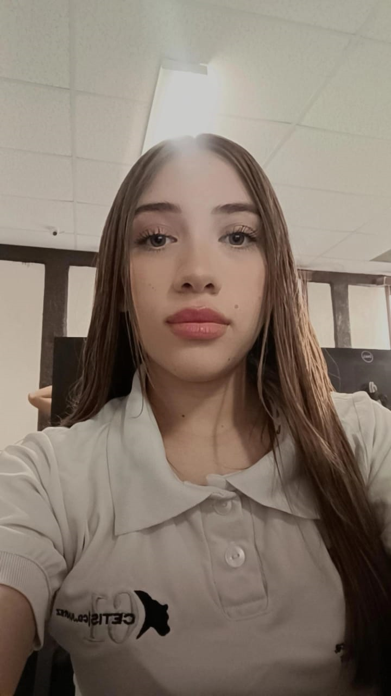

#### Nombre completo:Rangel Palacios Brisa
##### correo Electronico:[23308060610256@cetis61.edu.mx]
###### Institucion:[CETis61]

  

###### Analisis de Base de Datos

---

# INTRODUCCIÓN

Este informe presenta un análisis de mercado de aplicaciones nutricionales existentes, el diseño de una encuesta para recopilar datos de usuarios potenciales, resultados simulados de muestra y recomendaciones para el desarrollo de una futura aplicación nutricional.

---

## OBJETIVOS DE LA INVESTIGACIÓN

- Analizar funcionalidades, experiencia de usuario y modelos de negocio de aplicaciones nutricionales populares.  
- Comparar sus ventajas, desventajas y características innovadoras.  
- Identificar brechas de mercado o mejoras potenciales para un nuevo producto.  
- Preparar base para luego recopilar datos directos de usuarios potenciales (mediante encuesta) para validar necesidades y preferencias.

---

## METODOLOGÍA

Se realizó revisión documental de fuentes públicas (sitios oficiales y análisis especializados) para el análisis de aplicaciones.  
Seleccionamos 3 aplicaciones móviles/web de nutrición representativas (gratuitas, premium, pago) para análisis individual.  
Comparación mediante tabla resumen para destacar similitudes y diferencias.

Se diseñó una encuesta de 15 preguntas (abiertas y cerradas) y se generaron 30 respuestas simuladas para demostrar análisis estadístico y visualización.  
**Importante:** los datos de encuesta son *SIMULADOS* y deben ser reemplazados por respuestas reales tras la distribución.

---

## ANÁLISIS DE APLICACIONES

Las tres apps analizadas son:

1. **MyFitnessPal**  
2. **FatSecret**  
3. **Cronometer**

---

### MyFitnessPal

#### Funcionalidades principales
- Amplísima base de datos de alimentos (más de 11 millones de alimentos) que permite registrar comidas, escanear códigos de barras, búsqueda de alimentos de restaurante.  
- Registro de comidas, macros (carbohidratos, grasas, proteínas), y seguimiento de peso, ejercicio, medidas corporales.  
- Funciones avanzadas en versión Premium/Premium+: planificador de comidas, listas de compras, integración más rápida de logging, objetivos personalizados.  
- También recientemente añadió **“Weekly Habits”** (hábitos semanales) y sugerencias de alimentos por dietas (vegan, vegetariano, pescatariano) como parte de la actualización 2025.

#### Experiencia de usuario (UX)
- Interfaz ya muy conocida, establecida, con muchas funcionalidades; lo que puede implicar curva de aprendizaje para nuevos usuarios.  
- Buen diseño de búsqueda, escaneo de alimentos, logueo rápido de comidas.  
- Algunas críticas en foros indican que la experiencia en Android/iOS tiene bugs, ciertas integraciones no tan pulidas, interfaz algo pesada.  
- La actualización reciente añade elementos de gamificación/hábitos, lo que puede mejorar el *engagement*.

#### Modelo de negocio
- Versión gratuita con funcionalidades básicas (registro de alimentos, ejercicio, peso, macros).  
- Versión Premium / Premium+ mediante suscripción con funciones adicionales (Meal Planner, listas de compras, personalización avanzada, sin anuncios).  
- **Freemium** claramente; la gran base de usuarios permite monetizar mediante suscripción.

#### Puntos fuertes
- Gran base de datos de alimentos, lo que facilita el registro rápido.  
- Ecosistema maduro, gran cantidad de usuarios, integraciones con otros dispositivos/apps de fitness.  
- Funciones avanzadas para personalización y seguimiento detallado.  
- Buena reputación y visibilidad en el mercado.

#### Debilidades
- Muchas funciones avanzadas están detrás de la suscripción, lo cual puede limitar usuarios que solo quieren lo básico.  
- Base de datos tan amplia que en algunos casos incluye entradas erróneas (usuario-generadas).  
- Puede resultar abrumadora para usuarios principiantes.  
- Algunas críticas por bugs o soporte limitado.  
- Cierta saturación de funciones puede afectar la simplicidad.

#### Características innovadoras
- La nueva función **“Weekly Habits”** para fomentar hábitos semanales estructurados.  
- Logging de comidas mediante escaneo de código de barras o búsqueda rápida.  
- Planificador de comidas, listas de compra y recetas en la versión prémium.  
- Integración con múltiples dispositivos/apps del ecosistema de salud/fitness.
  
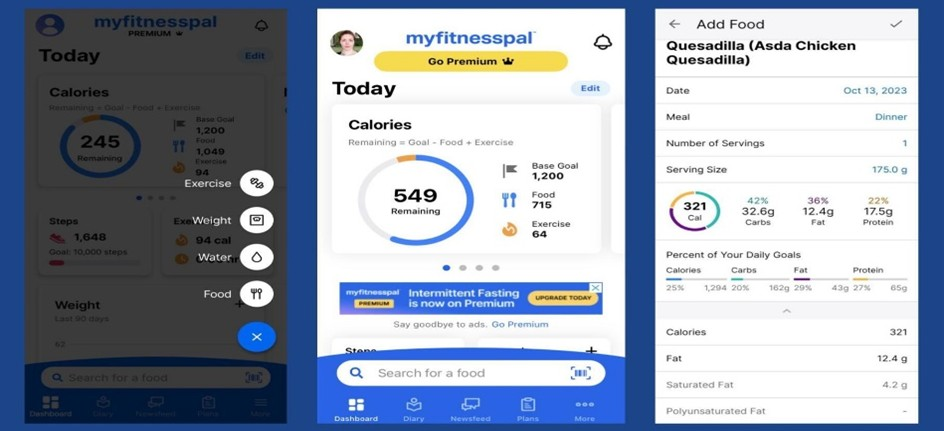

---

### FatSecret

#### Funcionalidades principales
- Contador de calorías, registro de alimentos con base de datos verificada (>1.9 millones de alimentos) para seguimiento preciso.  
- Escáner de código de barras para ingreso rápido de alimentos.  
- Registro de macronutrientes (y agua en la versión Premium), progresos en peso y gráficos de tendencia.  
- Comunidad de soporte, retos y logros (“achievements & streaks”) para motivación del usuario.  
- Versión Premium que añade funcionalidades como **“Smart Food Scan”** (reconocimiento de alimentos a partir de foto), planificador de comidas, etc.

#### Experiencia de usuario
- Interfaz relativamente sencilla, claro enfoque en conteo de calorías y macros, lo que la hace accesible para muchos usuarios.  
- Buen soporte de comunidad y motivación social, lo que favorece adherencia.  
- Algunas reseñas señalan que la base de datos, aunque grande, puede presentar inconsistencias en algunos alimentos o marcas menos comunes.

#### Modelo de negocio
- Versión gratuita con las funciones básicas suficientes para registro de alimentos, macros y peso.  
- Versión Premium mediante suscripción que desbloquea funcionalidades premium (Smart Food Scan, planificador, sin anuncios, etc.).

#### Puntos fuertes
- Base de datos verificada de alimentos (1.9 millones), lo cual aporta precisión.  
- Escáner de código de barras y registro bastante rápido.  
- Comunidad integrada como motivador social.  
- Buena opción “gratuita” para muchas funcionalidades básicas sin necesidad de pagar.

#### Debilidades
- Funciones avanzadas **premium** requieren suscripción; algunos usuarios sienten que funcionalidades importantes están bloqueadas.  
- Poca visibilidad de características innovadoras fuera del conteo de alimentos y macros (aunque están trabajando en ello).  
- Algunos problemas puntuales de sincronización con otras apps/dispositivos (por ejemplo, usuarios reportan duplicados al sincronizar con Google Fit).

#### Características innovadoras
- **Smart Food Scan** (foto del plato para estimar porciones y nutrientes) disponible en Premium.  
- Enfoque en comunidad, logros y motivación diaria (“achievements & streaks”) para fomentar hábitos.  
- **API de alimentos/verificación de alimentos** para desarrolladores, lo que denota que tienen un backend robusto de datos nutricionales.
  

---

### Cronometer

#### Funcionalidades principales
- Registro de alimentos con fuerte enfoque en nutrición micronutrientes (vitaminas, minerales), no solo macros.  
  Por ejemplo: más de **84 nutrientes** rastreados.  
- Base de datos de alimentos verificada (más de un millón de alimentos de fuentes confiables), lo cual mejora la precisión.  
- Sincronización con otros dispositivos/apps para tener una visión holística de salud (actividad, biométricos, etc.).

#### Experiencia de usuario
- Muy valorada por usuarios que desean un nivel más “profundo” de análisis nutricional: ver no sólo calorías/macros sino también vitaminas y minerales.  
- Interfaz quizá más “técnica” que apps más lúdicas/ligeras, lo cual puede intimidar a usuarios principiantes.  
- Usuarios han señalado diferencias/correcciones necesarias en algunos datos bastante técnicos (micronutrientes), lo que requiere cierto conocimiento.

#### Modelo de negocio
- Versión gratuita con funciones básicas de registro de alimentos, macros y algunos micronutrientes.  
- Versión **“Gold” o Pro** (suscripción) para profesionales de nutrición, exportación de datos, informes detallados e integración extendida.

#### Puntos fuertes
- Alta precisión y profundidad en datos nutricionales (micronutrientes).  
- Buena para usuarios exigentes, dietas especializadas y profesionales de salud.  
- Sincronización con otros sistemas de salud/dispositivos, lo que permite una visión más integral.

#### Debilidades
- Curva de aprendizaje para usuarios generales que solo quieren “contar calorías”.  
- Versión gratuita limitada comparada con lo que ofrecen otras apps para registro básico.  
- Algunas críticas de usuarios sobre discrepancias o necesidad de validar datos manualmente.

#### Características innovadoras
- Tracking de hasta **84 nutrientes** (vitaminas, minerales) además de macronutrientes.  
- Sincronización con dispositivos/biométricos para tener vistas integradas de salud (más allá de solo comida).  
- Diseño orientado tanto a usuario individual como a profesionales de nutrición (dietistas), con funcionalidades de exportación/informe.
  
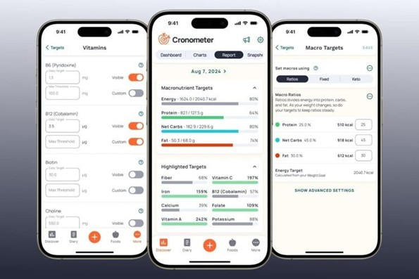

---
## Tabla Comparativa de Aplicaciones de Nutrición
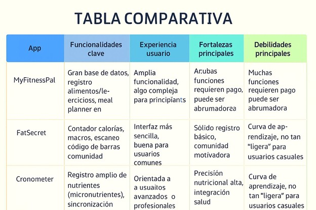

---

# Necesidades para una Aplicación Nutricional

**Objetivo:**  
Descubrir las necesidades reales, frustraciones y expectativas de usuarios potenciales para diseñar una aplicación que realmente resuelva sus problemas.

---

## Sección 1: Perfil y Objetivos del Usuario

### 1. ¿Cuál es tu principal objetivo al considerar tu nutrición? *

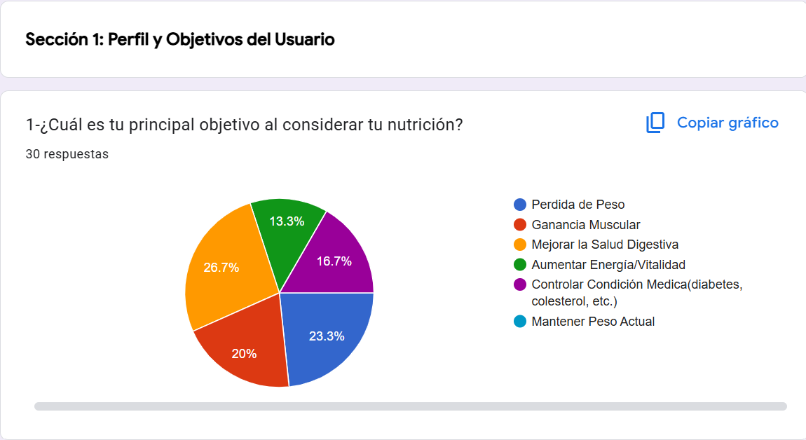

---

### 2. ¿Qué tan seguido piensas o te preocupas por tu alimentación?

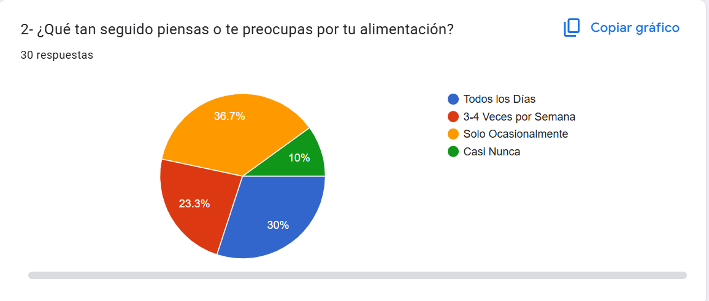

---

## Sección 2: Experiencia con Apps Existentes (Dolor y Frustración)

### 3. Si has usado apps de nutrición antes, ¿qué fue lo que MÁS te frustró? (Múltiple) *

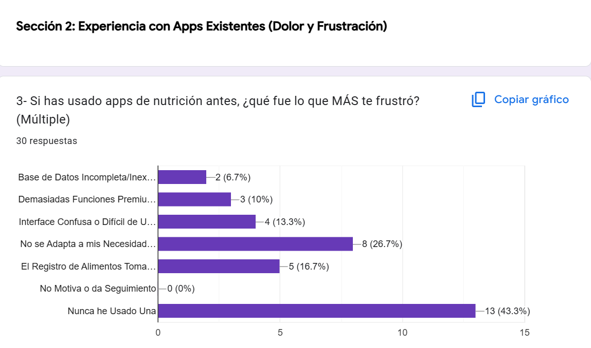

---

### 4. Si has usado apps de nutrición antes, ¿qué fue lo que MÁS te costó? *

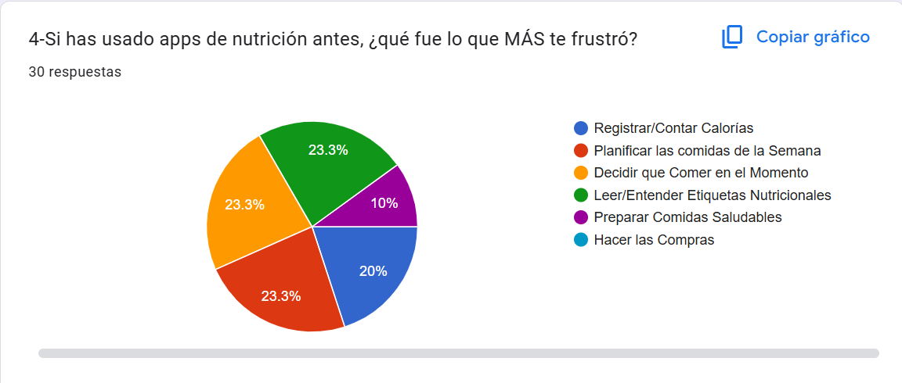

---

## Sección 3: Funcionalidades Específicas (Más Allá de lo Básico)

### 5. De estas funcionalidades innovadoras, ¿cuáles te serían MÁS útiles? (Elige top 3) *

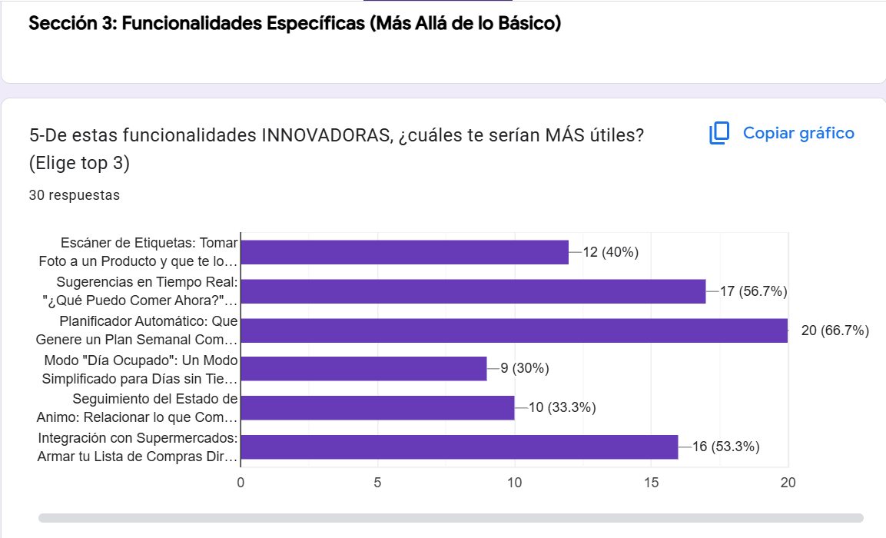

---

### 6. Imagina que la app pudiera resolver UN solo problema de tu día a día con la comida, ¿cuál sería? *

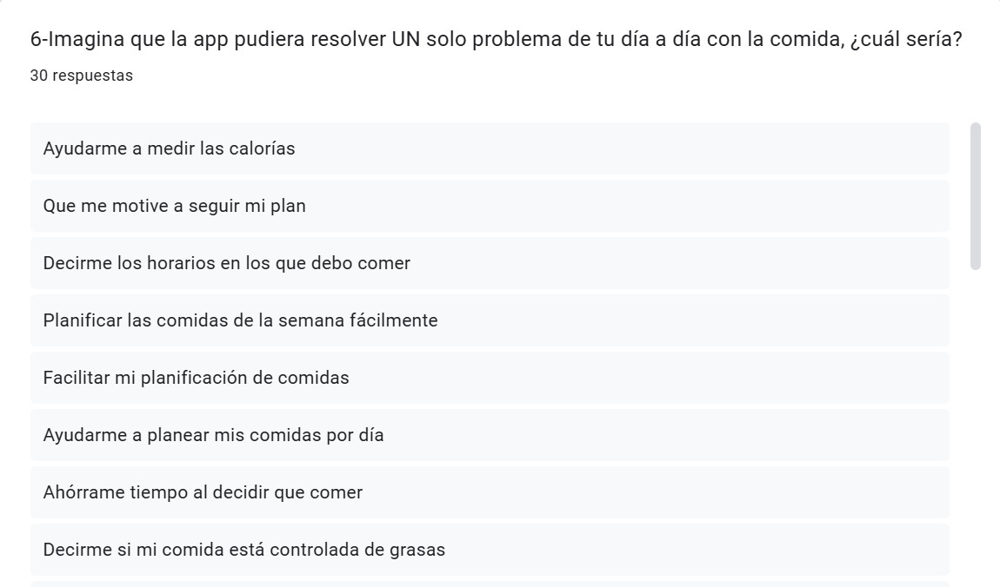
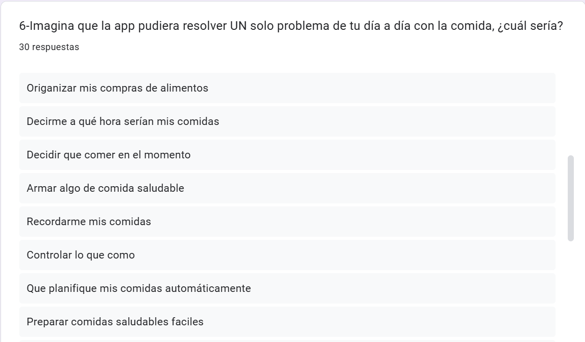
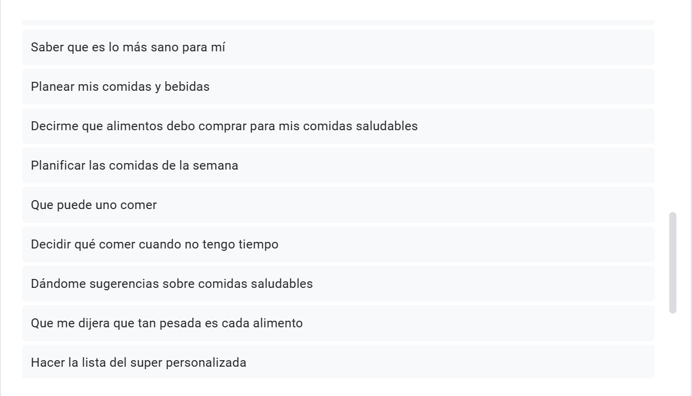
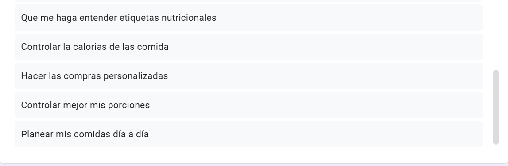

---

## Sección 4: Personalización y Adaptación

### 7. ¿Tu alimentación sigue algún régimen o tiene alguna restricción específica? (Múltiple) *

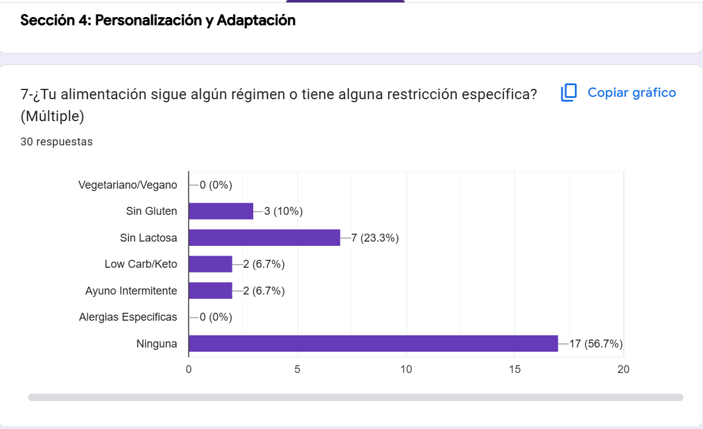

---

### 8. ¿Cómo te gustaría que la app se adaptara a tus progresos? *

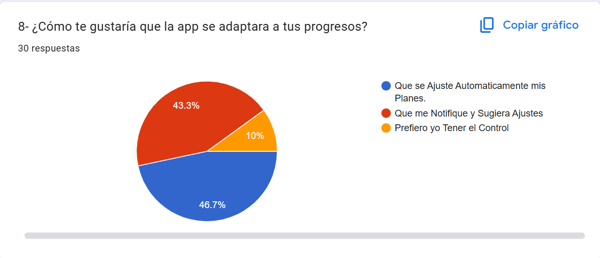

---

## Sección 5: Motivación y Compromiso

### 9. ¿Qué tipo de motivación funciona mejor para ti? *

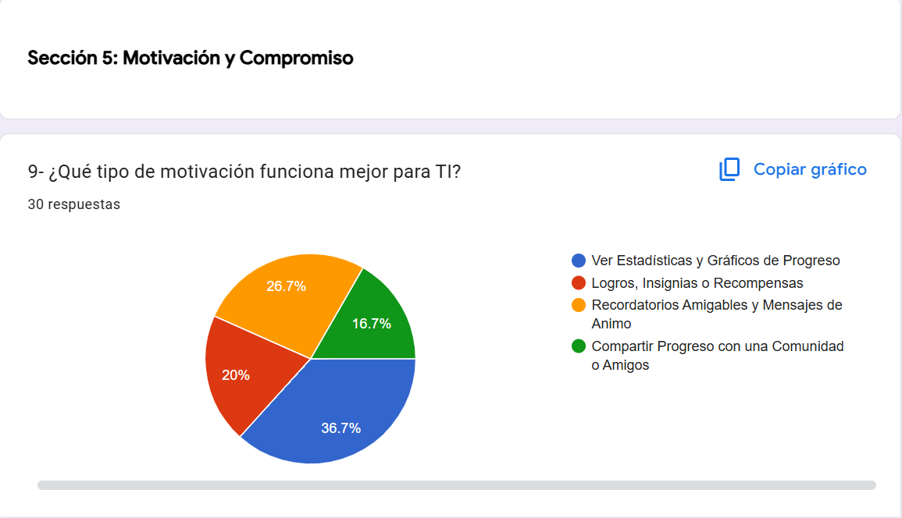

---

### 10. ¿Qué te haría abandonar una app de nutrición? (Múltiple) *

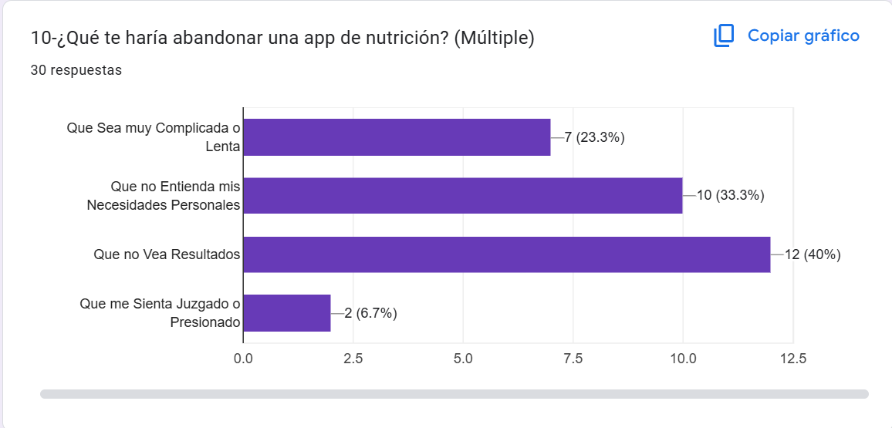

---

## Sección 6: Información Demográfica (Opcional)

### 11. Rango de edad *

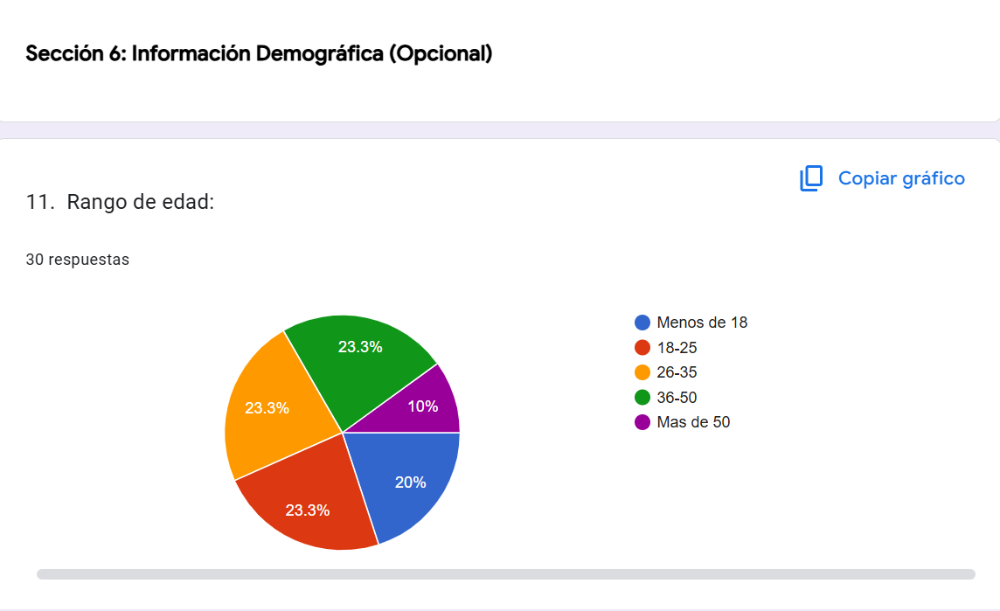

---

### 12. ¿Tienes alguna condición de salud que influya en tu dieta? *

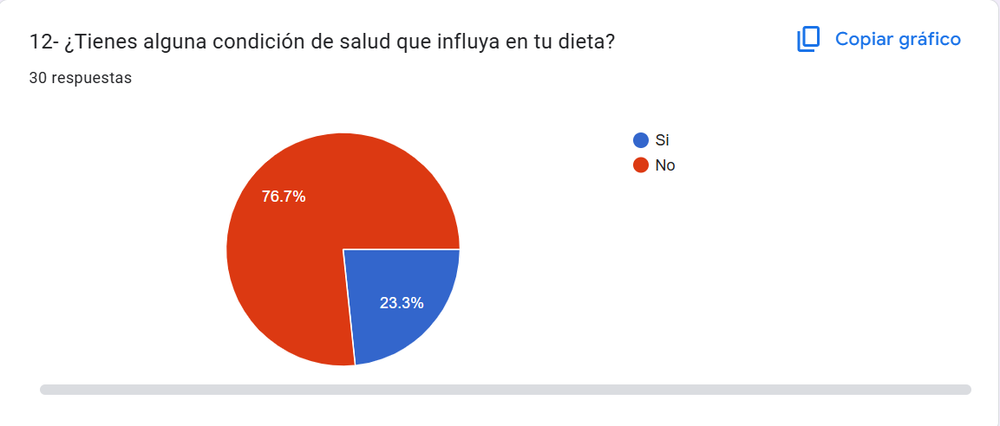

---

## Sección 7: Hábitos y Contexto Diario

### 13. ¿En qué momento del día te resulta más difícil mantener tus hábitos alimenticios? *

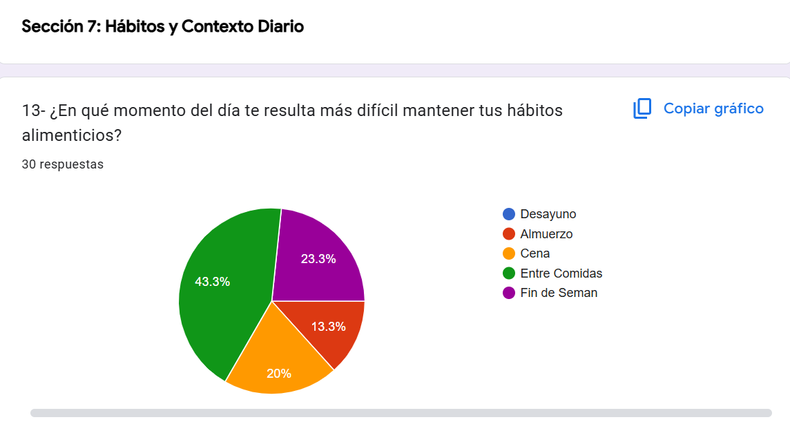

---

### 14. ¿Qué herramientas externas usas actualmente para organizar tu alimentación o entrenamientos? (Múltiple) *

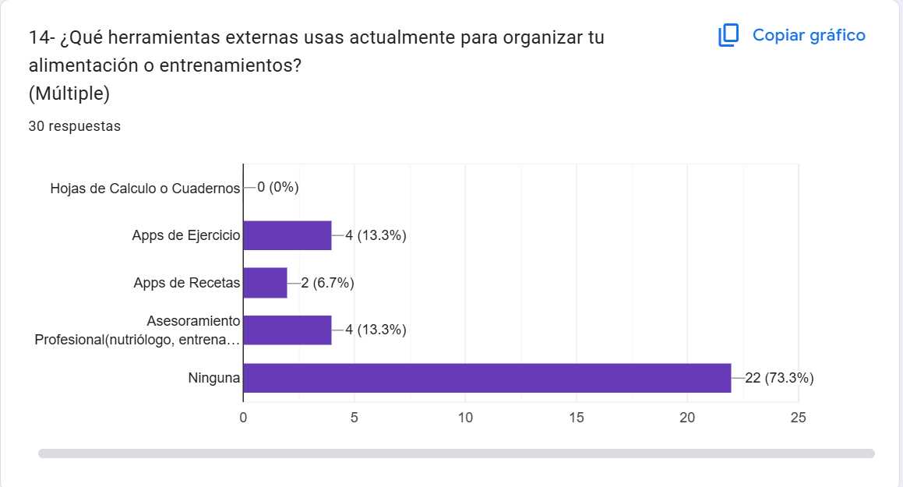

---

### 15. ¿Qué tipo de contenido te gustaría que la app incluyera además del seguimiento nutricional? (Múltiple) *

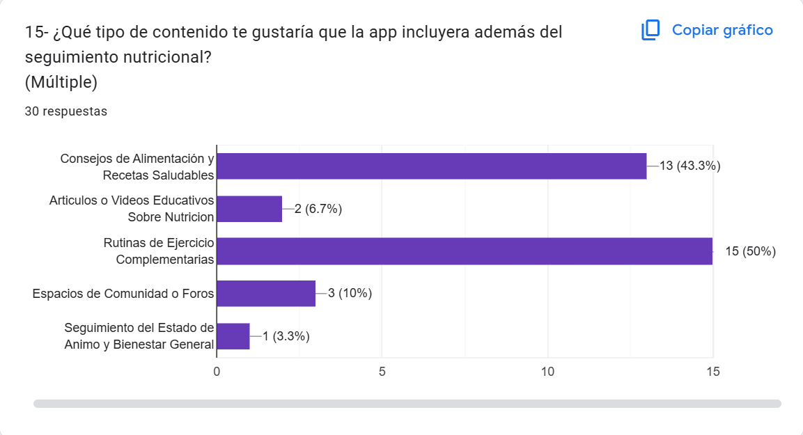

---

## ¡Gracias por tu ayuda!

Tus respuestas serán clave para crear una herramienta que realmente entienda y ayude a las personas.

---

### Formulario en línea
[Haz clic aquí para responder la encuesta en Google Forms](https://docs.google.com/forms/d/e/1FAIpQLSdGnig2Tn-q_5QgPFsWIAa-_4DuIz5GnUs4my5Lgvgvq7RnBQ/viewform?usp=sharing&ouid=110922887038578933095)

---

## Conclusiones y Oportunidades

### Síntesis de aprendizajes
Después de analizar las aplicaciones, aprendimos que la mayoría ofrece funciones muy completas para llevar el control de la alimentación, pero también que muchas pueden ser algo complicadas o tienen demasiadas cosas que no todos usan.  
Me di cuenta de que lo que más buscan los usuarios es que la app sea **fácil de usar**, tenga **información confiable** y que los **motive a seguir hábitos saludables** sin hacerlo tan pesado.

---

### Oportunidades identificadas para desarrollo futuro
Con todo lo que revisamos, vimos que hay una buena oportunidad para crear nuestra propia app, **Nutricional**, que sea más práctica y pensada para las personas que quieren cuidar su salud sin complicarse.  
Mi idea es que tenga:

- Un diseño simple y rápido de entender.  
- Planes personalizados según los objetivos de cada persona.  
- Recomendaciones diarias y tips fáciles de seguir.  
- Retos o logros que motiven al usuario.  
- Integración con relojes o apps de ejercicio.  
- Y, sobre todo, que sea confiable y cuide la privacidad de los datos.

---

### Recomendaciones para la futura aplicación
Para mejorar mi futura app, creo que sería bueno:

- Probarla con diferentes personas para ver qué tan fácil es usarla.  
- Hacer una versión gratuita y otra con funciones extra para quien quiera más opciones.  
- Colaborar con expertos en nutrición para asegurar que la información sea correcta.  
- Y cuidar que el diseño sea **atractivo, moderno y motivador**.
